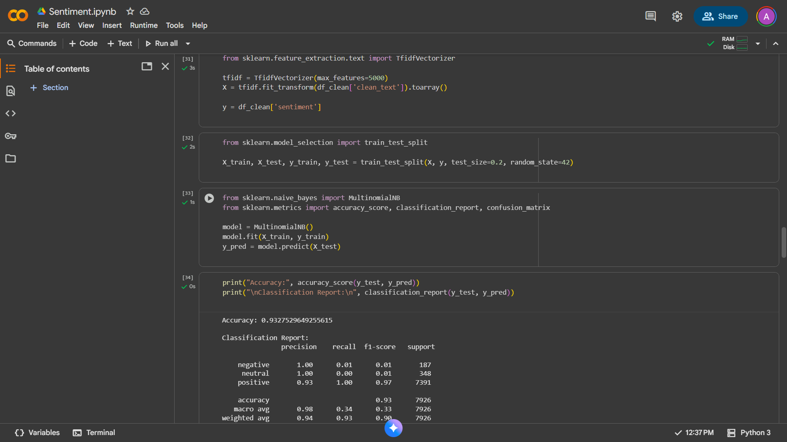
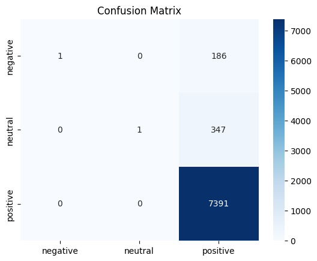
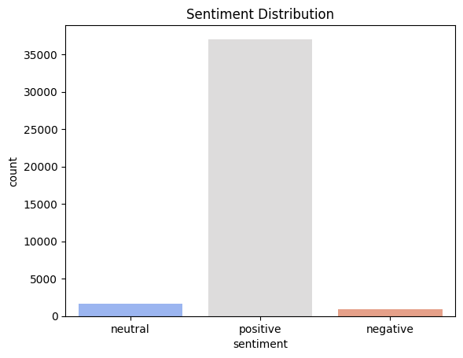

# 🧠 Sentiment Analysis using Machine Learning

## 📋 Project Overview
This project develops a **machine learning–based sentiment analysis system** that classifies product reviews as **positive**, **negative**, or **neutral**.  
It helps businesses understand customer satisfaction, improve product perception, and make data-driven decisions.

---

## 🎯 Objectives
- Automate the classification of customer reviews based on sentiment.
- Enable real-time insights for business strategy.
- Compare and benchmark traditional ML models for text analytics.

---

## 🧩 Problem Statement
Manual evaluation of thousands of product reviews is inefficient and inconsistent.  
The goal is to build an automated, scalable, and accurate sentiment analysis model that processes raw text reviews and determines user sentiment.

---

## 🔬 Methodology

### 1. **Data Preprocessing**
- Merged multiple datasets using **pandas**.  
- Cleaned missing values, punctuation, digits, and special characters using **regex**.  
- Applied **spaCy** for:
  - Tokenization  
  - Stopword removal  
  - Lemmatization  

### 2. **Label Generation**
- Converted numeric ratings to categorical sentiment labels:
  - ≤2 → Negative  
  - =3 → Neutral  
  - ≥4 → Positive  

### 3. **Feature Extraction**
- Transformed text into numerical features using **TF-IDF Vectorization**.  
- Compared performance with **CountVectorizer** as baseline.

### 4. **Model Training**
Trained and evaluated multiple supervised learning algorithms:
- Logistic Regression  
- Naïve Bayes  
- Support Vector Machine (SVM)

### 5. **Evaluation Metrics**
Measured model performance using:
- Accuracy  
- Precision  
- Recall  
- F1-Score  
- ROC-AUC  

---

## 📊 Results

| Model                | Precision | Recall | F1-Score | Accuracy | ROC-AUC |
|----------------------|------------|---------|-----------|-----------|----------|
| Logistic Regression  | 0.88       | 0.86    | 0.87      | 0.87      | ~0.91    |
| Naïve Bayes          | 0.85       | 0.84    | 0.84      | 0.85      | ~0.90    |
| **SVM (Best Model)** | **0.90**   | **0.89**| **0.89**  | **0.89**  | **~0.93**|

✅ **Winner:** Support Vector Machine (SVM) — best balance between precision, recall, and generalization.

---

## 💡 Key Insights
- **Logistic Regression:** Simple and interpretable, but limited in non-linear cases.  
- **Naïve Bayes:** Fast and efficient, but assumes feature independence.  
- **SVM:** Excels with high-dimensional text features and achieves the best overall performance.

---

## 🏢 Applications
- **E-commerce:** Identify dissatisfied customers early.  
- **Brand Monitoring:** Track sentiment trends over time.  
- **Customer Support:** Automatically route negative feedback for escalation.  
- **Market Research:** Evaluate consumer perception of new products.

---

## 🛠️ Tools & Libraries
| Category | Tools / Libraries |
|-----------|------------------|
| **Language** | Python |
| **Data Handling** | pandas, numpy |
| **Text Processing** | spaCy, nltk, re |
| **Machine Learning** | scikit-learn |
| **Visualization** | matplotlib, seaborn |

---

## 🚀 Future Enhancements
- Implement **deep learning models** (LSTM, BERT) for contextual understanding.  
- Build a **real-time sentiment API** using FastAPI or Flask.  
- Integrate **Kafka or Spark** for live data streaming and analysis.

---

## 📚 Dataset
- **Source:** [Kaggle – Datafiniti Amazon Consumer Reviews](https://www.kaggle.com/datasets/datafiniti/amazon-consumer-reviews-of-amazon-products)  
- **Size:** ~50,000+ reviews after preprocessing  
- **Features:**
  - `text` → Review text  
  - `rating` → Numerical rating (1–5)  
  - `sentiment` → Derived label (positive/neutral/negative)

---

## 🧾 License
This project is licensed under the **MIT License** – feel free to use and modify it for your research or business applications.

---

## 👨‍💻 Author
**Abhishek SR**  
Computer Science & Engineering Student  
_“Turning raw data into actionable insights.”_  
[GitHub Profile](https://github.com/therealabhi-sr)

---

## 🧠 Summary
This project demonstrates how **machine learning** and **NLP** can transform unstructured text into meaningful sentiment insights.  
Among tested models, **SVM** emerged as the top performer, showcasing robust generalization and reliability for enterprise-grade sentiment classification.

---

## 📊 Screenshots  

### 1. Model Accuracy  
  

### 2. Confusion Matrix
  

### 3. Distribution 

### 4. Word Cloud

